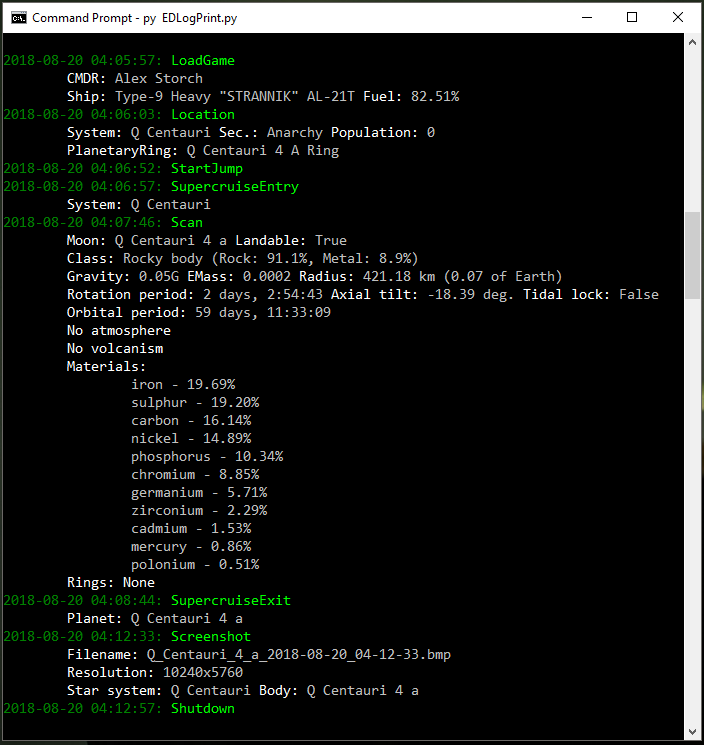

# Elite Dangerous Log Print

This app is a assistant which prints events from the game in a console window on a second monitor. Surface scanning events print complete information about the scanned body, which is helpful for exploration.

It also automatically renames screenshots from the game according to the scheme:
`<bodyname>_(coordinates on surface if available)_<datetime>.bmp`

## Requirements

Windows only  
Python 3.6+  
watchdog, colorama

## Screenshot

